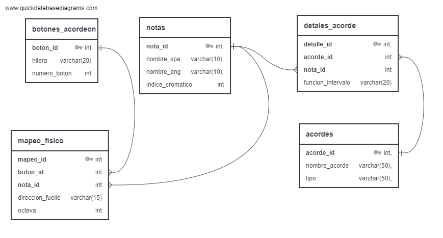

# Modelo Relacional de Teoria Musical y Mapeo de Instrumentos (SQL)

Este proyecto consiste en el diseño e implementacion de una base de datos relacional orientada a modelar los principios fundamentales de la teoria musical occidental (escala cromatica, intervalos y construcción de acordes) y su posterior anstraccion lógica para el mapeo físico en instrumentos musicales, con un enfoque inicial en la botonera de un acordeón diatónico de 31 botones (Tonalidad de FA).

El objetivo principal es demostrar habilidades avanzadas en SQL, incluyendo la normalización de datos para estructuras complejas no corporativas, el uso de restricciones de integridad para reglas de negocio estrictas, y la optimización de consultas mediante uniones multidimensionales (`JOINs`) y expresiones de tabla comunes (`CTEs`).

## Características del Proyecto

- **Modelado Teórico Puro:** Representación matemática y relacional de la escala cromática de 12 notas y sus funciones armónicas.
- **Catálogo Dinámico de Acordes:** Estructura flexible que permite la construcción de tríadas básicas, así como estructuras avanzadas (acordes disminuidos, aumentados y extensiones).
- **Abstracción de Instrumentos:** Mapeo lógico de la botonera física y la dirección del flujo del aire (fuelle abriendo/cerrando) para determinar la ejecución de notas.
- **Integridad de Datos Rigurosa:** Implementación de restricciones (`CHECK`, `FOREIGN KEY`, `ON DELETE CASCADE`) para asegurar que las reglas de la teoría musical se cumplan a nivel de motor de base de datos.

## Arquitectura de la Base de Datos

El diseño sigue las mejores prácticas de normalización (3NF) para evitar la redundancia de datos. El esquema inicial incluye:

1. **`notas`**: Catálogo base de la escala cromática con índices absolutos.
2. **`acordes`**: Catálogo que define el tipo y nombre de las estructuras armónicas.
3. **`detalles_acorde`**: Tabla puente para modelar la relación de muchos a muchos entre notas y acordes, identificando la función del intervalo (fundamental, tercera, quinta, etc.).

> **Nota:** Diagrama diseñado utilizando [QuickDBD](https://www.quickdatabasediagrams.com/).
